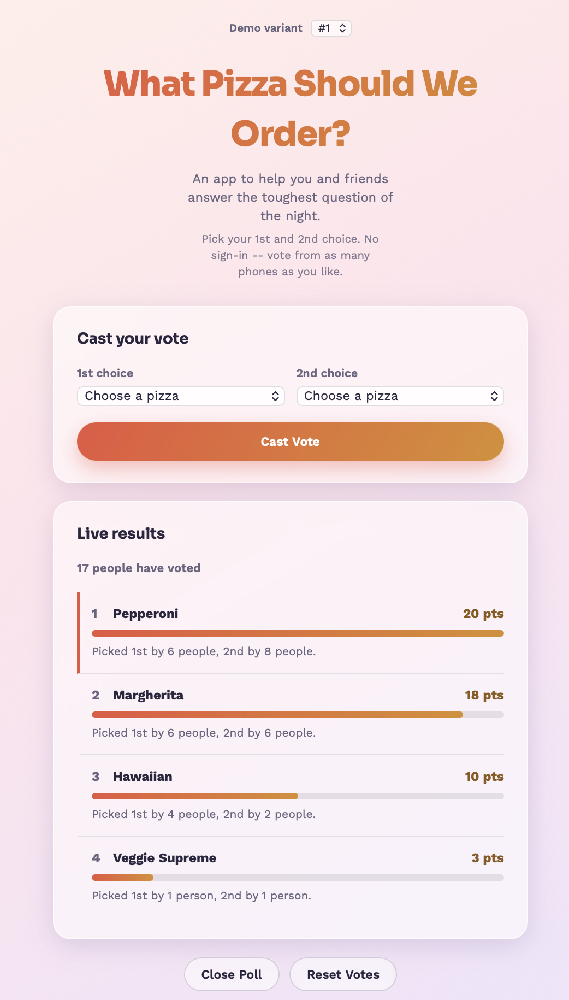
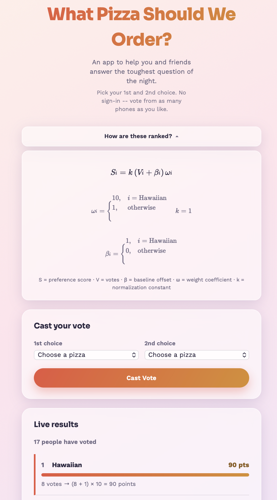

# What Pizza Should We Order?

A small Flask app to help you and your friends settle the toughes question of the night: pizza!

Each of the app's four variants is built around a specific holding in Section 230 case law about when a platform is legally responsible for content a user supplied, teaching the case via demo. 

<table>
<tr>
<td width="50%"></td>
<td width="50%"></td>
</tr>
<tr>
<td align="center"><em><b>#1 Fixed list.</b> Four options, chosen by
the operator. Nothing else can be selected.</em></td>
<td align="center"><em><b>#4 Weighted formula.</b> Any pizza can be
voted for. The ranking formula and its parameters are chosen by the
operator.</em></td>
</tr>
</table>

## Legal background

The reference case is *Fair Housing Council of San Fernando Valley v.
Roommates.com, LLC*, 521 F.3d 1157 (9th Cir. 2008) (en banc).
Roommate.com operated a roommate-matching site. It required users to
answer questions about sex, sexual orientation, and familial status by
choosing from answer options the site itself wrote, then used the
answers to filter search results and match users. The Ninth Circuit,
en banc, held that Section 230 of the Communications Decency Act, 47
U.S.C. § 230, did not immunize Roommate.com for the questionnaire, the
filtered search, or the matching system: requiring users to select
from a limited, site-authored set of answers to a specific question
made the site a co-developer of that content, not merely a publisher
of someone else's speech. The same opinion held that a separate,
open-ended "Additional Comments" field on the same site kept its
immunity, because the site supplied no answer choices there and
prompted nothing. The court's own term for the distinction was
"neutral tools."

The underlying discrimination claim did not succeed. On remand, the
Ninth Circuit held in 2012 that the Fair Housing Act's definition of
"dwelling" does not reach the selection of a roommate who will share a
home, construing the statute narrowly under the canon of
constitutional avoidance in light of the privacy and
intimate-association interests a broader reading would implicate.
*Fair Housing Council of San Fernando Valley v. Roommate.com, LLC*,
666 F.3d 1216 (9th Cir. 2012). Roommate.com won on that ground. The
2008 Section 230 holding is the part that survives as doctrine
independent of that outcome.

**Variant #1 (Fixed list)** corresponds to the questionnaire: a closed
set of options the operator wrote, which a user can only select from,
not add to.

**Variant #2 (Open list)** corresponds to the Additional Comments
field: no operator-supplied options, and every option on screen was
typed in by a user.

**Variant #3 (Filtered list)** concerns Section 230(c)(2)(A), which
immunizes a provider's good-faith decision to restrict access to
material it considers objectionable. Courts generally do not require a
provider to give an accurate or complete reason for a removal or
rejection, and most such decisions are covered by Section 230(c)(1)'s
broader publisher immunity without (c)(2)(A)'s good-faith requirement
ever being reached. The recognized exception is a demonstrably
pretextual reason for the restriction, which some courts have held
defeats good faith. This variant avoids that fact pattern rather than
testing it: the rejection message discloses the actual mechanism (a
1-in-3 random rejection) instead of substituting a false one, so there
is no pretext to evaluate.

**Variant #4 (Weighted formula)** concerns a separate, unresolved
question: whether a platform's own ranking or recommendation logic,
applied to unaltered user input, is something the platform can be held
responsible for, distinct from the underlying content itself.

*Force v. Facebook, Inc.*, 934 F.3d 53 (2d Cir. 2019), cert. denied
(2020), held that Facebook's newsfeed-ranking and friend-suggestion
algorithms fall within Section 230(c)(1)'s protection for traditional
editorial functions. The Second Circuit rejected the argument that
using an algorithm to select and arrange third-party content makes a
platform a co-developer of that content.

*Gonzalez v. Google LLC*, 598 U.S. 617 (2023), presented the same
question for a different recommendation algorithm (YouTube's). The
Supreme Court granted certiorari on the Section 230 question but did
not decide it. Its per curiam opinion vacated and remanded in light of
the companion case *Twitter, Inc. v. Taamneh*, 598 U.S. 471 (2023),
which held the plaintiffs' underlying claim failed on its own terms
regardless of Section 230. The scope of Section 230 for recommendation
algorithms remains undecided at the Supreme Court.

*Moody v. NetChoice, LLC*, 603 U.S. 707 (2024), is a First Amendment
case, not a Section 230 case. The Court held, 9-0, that neither of two
lower courts had properly analyzed facial First Amendment challenges to
Florida and Texas content-moderation statutes, and vacated and
remanded both. The majority opinion, by Justice Kagan, stated that, at
least on the record before it, a platform's editorial judgments in
compiling third-party posts into a product like a newsfeed are the
platform's own protected expressive activity. Four justices wrote
separately rather than joining that reasoning in full, and the opinion
left open how the principle applies to engagement-based ranking rather
than the values-based moderation examples it discussed.

*Anderson v. TikTok, Inc.*, 116 F.4th 180 (3d Cir. 2024), applied
Moody's language to Section 230. A ten-year-old died after TikTok's
algorithm recommended a "Blackout Challenge" video to her For You Page.
The Third Circuit held Section 230 did not bar claims based on that
recommendation: because compiling and ranking third-party content into
a feed is, per Moody, the platform's own protected expressive activity,
it is the platform's own information for Section 230 purposes too, and
Section 230 immunizes only information "provided by another." This
conflicts with *Force* and with pre-Moody decisions in several other
circuits, which the panel treated as superseded by Moody rather than
reconciled with. The Third Circuit denied rehearing en banc in October
2024. TikTok sought further review; based on the most recent sources
available to me, the Supreme Court has not granted certiorari on this
question, and the underlying case has proceeded on the merits in
multidistrict litigation. A coalition of organizations including the
Electronic Frontier Foundation filed an amicus brief arguing the panel
extended Moody's language about values-based moderation to a different
context -- engagement-based ranking -- that the Supreme Court had not
addressed. Whether this holding is confined to the Third Circuit or
spreads further is unresolved.

A related, non-230 example: in March 2019, HUD charged Facebook with
violating the Fair Housing Act, finding that its ad delivery algorithm
skewed which users received housing ads along protected-characteristic
lines even when an advertiser had targeted a broad, non-discriminatory
audience. Facebook contested the charge, sending it to the Department
of Justice, which sued and settled in June 2022; Meta agreed to stop
using its "Special Ad Audience" targeting tool for housing ads and to
build a new delivery system subject to DOJ approval and court
oversight. That case turned on a delivery algorithm's output rather
than a user-facing choice, and arises under a different statute, so it
doesn't resolve the Section 230 questions above. It's included because
it's a documented instance of an algorithm's own output, independent
of what was requested of it, being treated as the basis for a legal
claim.

Variant #4 isolates the fact pattern this line of cases disagrees
about: user input (votes) is unaltered, and a ranking function chosen
entirely by the operator (a weight ω and baseline β assigned to each
pizza) determines the outcome, expressed as a checkable formula rather
than a hard override.

> This is a teaching demo, not legal advice, and I'm not a lawyer. The
> citations above are current as of when this was written. Several of
> the questions discussed -- the scope of Section 230 for algorithmic
> ranking, and the current status of *Anderson v. TikTok* specifically
> -- are actively litigated and may have changed since.

---

## Quick start

```bash
pip install -r requirements.txt
python app.py
```

Then open **http://127.0.0.1:5000** in your browser. Open it again in
as many windows or tabs as you like -- every one of them can vote.

### Letting other people vote from their own devices

By default the app only listens on your own computer. To let other
people on the same Wi-Fi vote from their phones or laptops, change the
last line of `app.py` to:

```python
app.run(host="0.0.0.0", port=5000, debug=False)
```

Then share `http://<your-computer's-local-ip>:5000` with them. Only do
this on networks you trust -- there's no login, so anyone who can
reach that address can vote, and can see the Close Poll / Reset Votes
buttons too.

> If port 5000 is already taken (common on macOS, which uses it for
> AirPlay Receiver), change `port=5000` to something else, like 5050,
> in that same line -- or just pass `--port 5050` (see below).

### Getting an actual public link (via ngrok)

If you'd rather send friends a real link than get everyone onto your
Wi-Fi, the app can wrap itself in an [ngrok](https://ngrok.com) tunnel:

1. Install the extra dependency (kept separate so the base app doesn't
   need it):
   ```bash
   pip install -r requirements-ngrok.txt
   ```
2. Sign up for a free ngrok account and grab your authtoken from
   [the dashboard](https://dashboard.ngrok.com/get-started/your-authtoken).
3. Connect that token once -- this is a one-time setup step, not
   something you repeat per session:
   ```bash
   ngrok config add-authtoken YOUR_TOKEN_HERE
   ```
4. Run the app with the tunnel:
   ```bash
   python app.py --ngrok
   ```
   The console prints a public `https://...ngrok-free.app` link.
   Texting that to friends is enough -- they don't need to be on your
   network at all.

A few things worth knowing: the link is fully public and the app has
no login, so anyone who has it can vote, close the poll, or reset it
-- only send it to people you actually want voting. The free ngrok
tier hands out a new random URL every time you start the tunnel, and
the link stops working the moment `python app.py --ngrok` stops
running on your machine -- it's a live tunnel to your laptop, not a
hosted website. `--port` works together with `--ngrok` if 5000 is
taken: `python app.py --ngrok --port 5050`.

I can't spin this tunnel up myself and hand you a working link --
running it requires your own machine and your own ngrok account, so
this part only comes alive once you run it locally.

## Variants

- **#1 Fixed list.** Exactly four pizzas -- Margherita, Pepperoni,
  Hawaiian, Veggie Supreme by default -- and nothing else can be
  picked. Edit `FIXED_PIZZAS` near the top of `app.py` to change them.
- **#2 Open list.** There's no preset list at all. Every option is
  typed in by a voter (pick "Other" in either dropdown), and it sticks
  around afterward as a real, selectable option for everyone who
  votes next.
- **#3 Filtered list.** Works like "Open list," except every new
  submission has a 1-in-3 chance of being rejected at random -- pick
  "Other," type a pizza, and about a third of the time it just won't
  go through, with no relationship to what you actually typed.
- **#4 Weighted formula.** The same 4 pizzas as "Fixed list," but ranked
  by a formula rendered as real math (via [KaTeX](https://katex.org/),
  loaded only for this variant) instead of a plain vote count or a
  sentence of prose: `S_i = k(V_i + \beta_i)\omega_i`, with `\omega`
  (weight) and `\beta` (baseline) defined per pizza right below it.
  Underneath the notation it's the same simple rule as before --
  Hawaiian gets weight `10` and baseline `1`, everyone else gets `1`
  and `0` -- and each result row still shows its own plain arithmetic
  (e.g. "1 vote -> (1 + 1) x 10 = 20 points") so the real numbers are
  checkable by hand, not just implied by the notation.

Switching the dropdown moves between four independent polls -- votes,
options, and open/closed state are all tracked separately per variant,
so voting in one doesn't affect the others.

### A note on the "Filtered list" variant

When a submission gets rejected, the popup opens with a deliberately
vague line -- "Suggestion not approved" -- because that flavor of
non-answer is a real thing real products do, and it's worth
recognizing on sight. What it doesn't do is invent a specific false
reason for the rejection (a fake policy citation, a claim that your
pizza topping is somehow "discriminatory" or "illegal," anything with
the shape of real legal authority behind it). Instead the same popup
immediately says what's actually happening: it's a coin flip, roughly
1 in 3, unrelated to what was typed. A specific false accusation aimed
at whoever's on the other end of that dice roll isn't something
showing the code elsewhere can undo -- unlike the ranking in the
"Weighted formula" variant, there's no real number to point to that
makes "this violates the law" true. Naming the pattern instead of
running it keeps the interesting part (a hard-to-argue-with denial)
without that part.

### A note on the "Weighted formula" variant

This variant's whole point is to make an unequal outcome look like
the output of neutral math instead of a choice someone made -- that's
a real pattern worth being able to recognize (companies do say "the
algorithm decided," when a person set the parameters that decided it).
Dense notation is part of how that pattern works in the wild: a
formula with Greek letters and subscripts reads as more authoritative
than the same rule in plain English, even when -- as here -- it's
exactly as simple underneath. What's built here plays that notation
straight, but doesn't hide the inputs behind it: Hawaiian's weight and
baseline are real, visible numbers, defined right in the formula and
worked out again per pizza in the results, so anyone looking can see
why it tends to win and can even test the formula's limits (vote
enough for one other pizza and it genuinely overtakes Hawaiian, since
this is real math, not a hard override). A version where those two
numbers were undiscoverable was part of an earlier ask in this
project's history and isn't what got built, for the same reason:
that's the difference between showing a pattern and running it on
whoever's looking.

The formula itself now sits behind a "How are these ranked?" toggle,
closed until someone taps it -- a block of subscripted math isn't
something everyone wants staring back at them before they've even
voted. What's not behind that toggle is each pizza's own arithmetic in
the results below: "1 vote -> (1 + 1) x 10 = 20 points" is in plain
view either way, so the gap between Hawaiian and whatever's actually
winning on votes is visible at a glance, with or without opening the
formula.

## How it works

- **No login, no tracking.** Nothing remembers who voted, so a new
  browser window (or the same one, again) can always vote again.
- **Ranked voting.** In "Fixed list," "Open list," and "Filtered
  list," each vote is a 1st choice, worth 2 points, and a 2nd choice,
  worth 1 point -- a common way to score a two-rank ballot. The raw
  1st-/2nd-choice counts are always shown too. "Weighted formula"
  scores differently -- see above.
- **Live results.** The results panel refreshes itself every few
  seconds without reloading the whole page.
- **Close Poll** stops new votes for the current variant and shows a
  final winner announcement plus the full breakdown.
- **Reset Votes** is always available, whether the poll is open or
  closed. It clears that variant's votes and any pizzas people added,
  and reopens voting if it was closed.
- Everything lives in `poll.db`, a SQLite file created next to
  `app.py`. Delete that file any time for a completely fresh start
  across all four variants.
- **Look.** Light glassmorphism throughout -- frosted, semi-transparent
  cards over a soft gradient background, blurred color shapes behind
  everything. Colors and blur amounts live at the top of
  `static/style.css` as CSS variables (`--tomato`, `--gold`,
  `--glass-bg`, etc.) if you want to retune it.

## Customizing

- Edit `FIXED_PIZZAS` in `app.py` to change the fixed-list options.
- Edit the `VARIANTS` dictionary in `app.py` to rename variants, change
  their descriptions, or adjust the note shown under the header.
